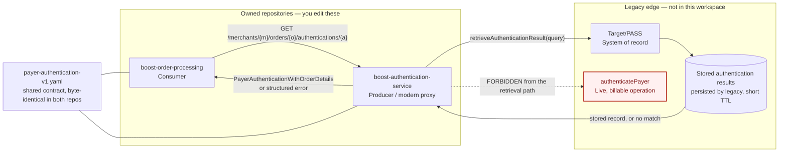
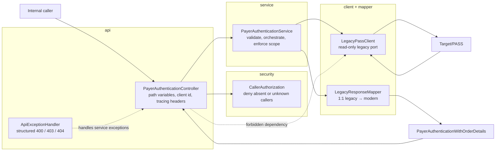
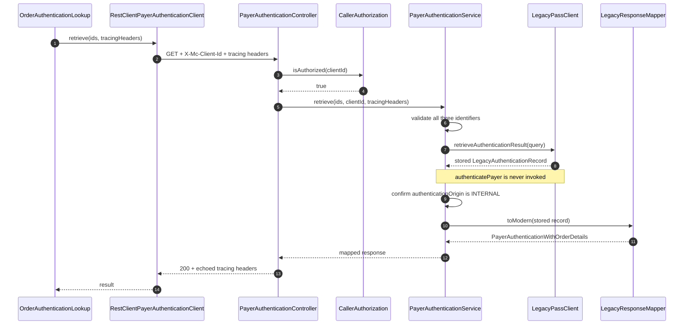
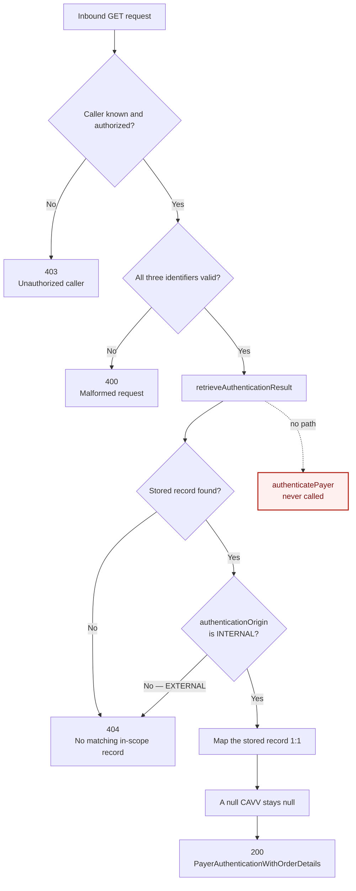
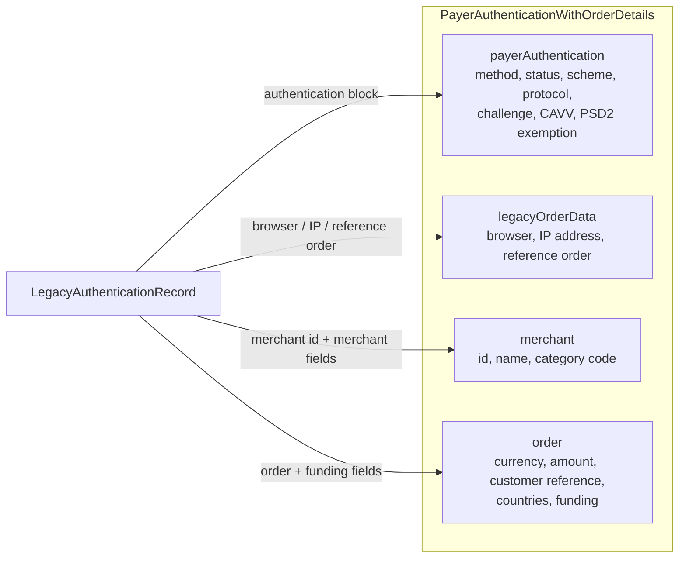
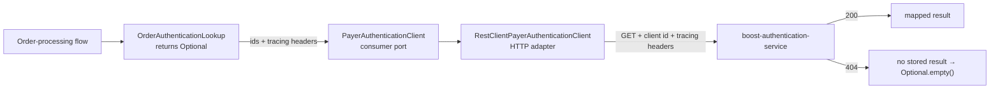
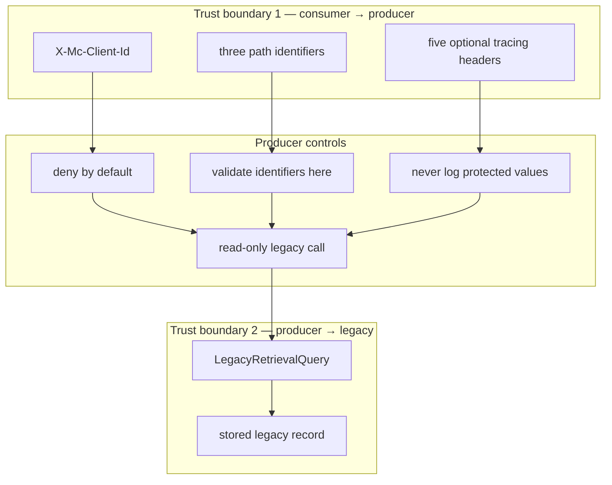
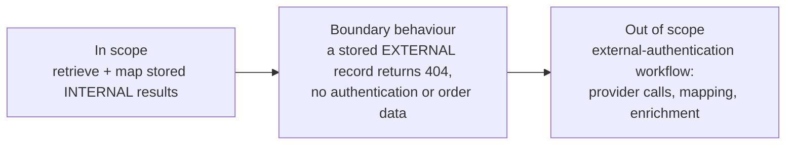
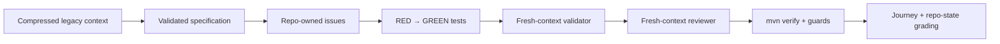

# Retrieve Payer Authentication Results — architecture

The intended architecture for `PGSE-88`: what the finished feature looks like across both owned
repositories and the legacy edge.

**This describes the target state, not the starter.** The repository you clone ships an
unfinished draft — the mapping, the tracing headers and the error semantics are deliberately
incomplete, and the spec that defines them is not yet validated. Use this document to understand
where you are heading; use [`LAB_ACTION_GUIDE.md`](boost-authentication-service/LAB_ACTION_GUIDE.md)
to get there.

---

## 1. System context

`boost-order-processing` consumes a modern retrieval API. `boost-authentication-service` owns that
API and proxies read-only retrieval to Target/PASS, which remains the system of record.
Target/PASS is **not in this workspace**; everything you may rely on about it lives in
[`.claude/context/target-pass-proxy.context.md`](.claude/context/target-pass-proxy.context.md).

**Responsibilities**

| Component | Owns |
|---|---|
| `boost-order-processing` | Asking for a stored result. It implements no authentication behaviour of its own. |
| `boost-authentication-service` | Authorizing the caller, validating input, retrieving, mapping, and returning the result. |
| Target/PASS | The stored authentication outcome, and the read operation that returns it. |
| `payer-authentication-v1.yaml` | The response and error contract both repos agree on. |
| `authenticatePayer` | A separate live, billable operation — unreachable from any retrieval path. |

## 2. Producer component architecture

A strict layer direction: HTTP concerns enter through `api`, orchestration stays in `service`, and
legacy communication and mapping sit behind their own boundaries.

`LayeringArchTest` enforces exactly one rule, mechanically, in `mvn verify`: no class in `..api..`
may depend on a class in `..client..`. The controller reaches the legacy edge through the service
layer or not at all.

## 3. Successful request sequence

All five tracing headers travel from the consumer, through the producer, into the legacy retrieval
query. Values are propagated unchanged and never logged.

**The propagated set:** `X-Client-Correlation-Id`, `X-Mc-Correlation-Id`,
`X-Mc-Correlation-Request-ID`, `X-Mc-Tns-Logging-Id`, `X-Mc-Toggle-Version`.

Tracing headers are **not** part of the legacy lookup key. The key is the combination of merchant,
order and authentication-transaction identifiers — all three, together. The `correlationId` on a
*returned* record is a different value: the id under which the legacy platform persisted that
response.

## 4. Retrieval decision flow

Errors are structured objects. They never carry internal exception messages or payload data.

Note that **absent** and **out of scope** converge on the same 404 — see §8.

## 5. Data mapping

The mapper performs a direct transformation. It does not compute authentication outcomes, repair
missing fields, or create a local source of truth.

The field-by-field map is in the compressed context and is 1:1 — nothing computed, defaulted or
enriched.

**On sensitive data.** CAVV, PAN, customer reference, countries and IP address are part of the
contractually required response — that is what a retrieval API returns. What is forbidden is
letting any of it reach a **log line, an error message, an exception message or a metric label**.
The response body is the answer; the log sink is the leak.

## 6. Consumer architecture

The consumer duplicates neither the producer's mapping nor its error logic. A producer `404` means
*business absence*, not a transport failure — that distinction is the consumer's whole job here.

Richer handling of other non-2xx statuses is a reasonable extension, but the spec does not define
it, so the baseline does not invent one.

## 7. Trust and data boundaries

**Every interface is a trust boundary, including an internal one.** The controls:

- Deny missing and unknown callers.
- Validate the request *in this service* — never on the assumption an internal caller already did.
- Keep api / service / client / mapper / security responsibilities separated.
- Read URLs, client ids and environment-specific values from configuration.
- Propagate tracing values; never log them.
- Return stored authentication data without recomputation or enrichment.
- Keep the live billable operation outside every retrieval path.

## 8. Scope boundary

The endpoint serves **internally authenticated** transactions. Building support for
externally-authenticated ones — a provider, an alternate authentication path, a second retrieval
flow — is outside `PGSE-88`.

**Refusing to serve an `EXTERNAL` record is not "handling" external authentication — it is the
absence of it.** That guard is required; building the workflow is the scope creep. Getting this
backwards produces one of two opposite mistakes: exposing excluded data because no boundary was
enforced, or inventing a workflow the spec never authorized.

**Why 404 specifically.** This API does not confirm the existence of records outside its scope, so
absent and out-of-scope are deliberately indistinguishable to the caller. 404 is also already
declared in the shared OpenAPI contract, so refusing this way requires no contract change across
the two repos.

A constraint stated without an observable is the worst of both worlds: doing nothing violates it,
and doing something feels like inventing behaviour. The spec pins the observable so the code has
something to build to and the validator has something to check.

## 9. Verification architecture

Each layer answers a different question, and none of them substitutes for another.

| Layer | Question it answers |
|---|---|
| Compressed context | What may we rely on about the system we cannot see? |
| Specification | What *should* this feature do? |
| Tests | What does the implementation *demonstrably* do? |
| Fresh-context validation | Does the diff satisfy the criteria, judged without author bias? |
| Fresh-context review | Does the whole change respect engineering and security rules? |
| Gates | Are tests, the architecture rule, the shared contract and the sensitive-data scan green? |
| Grading | Do the process trail *and* the final repository behaviour both hold up? |

**What the gates actually enforce**, so nothing here reads as more than it is: `mvn verify` runs
the test suites, the ArchUnit layering rule and the consumer contract test, and produces a JaCoCo
coverage *report* — there is no coverage threshold that fails the build. The PAN/secret guard and
the PR gate are enforced as `PreToolUse` hooks, not by Maven.

## References

- [Lab action guide](boost-authentication-service/LAB_ACTION_GUIDE.md) — the stage-by-stage script
- [Compressed Target/PASS context](.claude/context/target-pass-proxy.context.md) — the only
  authority on the legacy edge
- [Feature non-negotiables](boost-authentication-service/specs/NON_NEGOTIABLES.md)
- [Feature specification](boost-authentication-service/specs/retrieve-payer-auth.spec.md) —
  ships **incomplete**; you complete and validate it in Stage 2
- [Shared OpenAPI contract](boost-authentication-service/src/main/resources/openapi/payer-authentication-v1.yaml) —
  byte-identical in both repos
- [Producer engineering guidance](boost-authentication-service/CLAUDE.md)
- [Consumer engineering guidance](boost-order-processing/CLAUDE.md)
