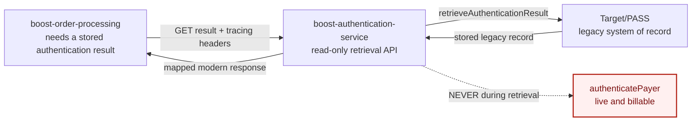

# Lab 2: The Call You Must Not Make Twice

**Thread:** `PGSE-88` Retrieve Payer Authentication Results (AFR domain) · **Level:** 200 ·
**Duration:** 120 minutes · **Topology:** two owned repos plus a legacy edge you cannot see

---

## The scenario

Refunds shipped (Lab 1). Order Processing now needs payer authentication results for
transactions the gateway authenticated **internally**. Boost does not have that capability yet.
Legacy **Target/PASS** is still the system of record, and it is **not in your workspace**.

A squad member scaffolded a first-pass draft of the modern endpoint in
`boost-authentication-service` before the spec was locked. Complete-record retrieval works and
the tests are green. Nothing in it looks wrong. That's exactly the point: a plausible, tested
draft can still be doing something expensive on every call. You are finishing it, spec-first,
across two repos.

> **Authenticate Payer is a billable event. This API retrieves. It never re-authenticates.**



Two repos you own, one legacy platform you cannot see, and one operation on it that must never be
reached from this path. The behaviour you are building toward:

- Retrieve the stored record exactly once.
- Return it as stored, including a null CAVV, unchanged.
- Never call `authenticatePayer` from the retrieval path.
- Map the legacy record to `PayerAuthenticationWithOrderDetails`.
- Serve internally-authenticated transactions only.
- Propagate the tracing headers without logging their values.
- Return distinct `400`, `403` and `404` errors.
- Never log CAVV, PAN, PII, requests, responses or stored records.

For component boundaries, the full request flow, trust boundaries and repository ownership, see
[`ARCHITECTURE.md`](ARCHITECTURE.md).

**Your role:** the engineer finishing the inherited draft.

**What you are building:** a read-only proxy that returns
`PayerAuthenticationWithOrderDetails`, honours the tracing headers and 404/403/400, logs nothing
sensitive, and never triggers a second Authenticate Payer, plus the consumer wiring in
`boost-order-processing`.

**This is the second lab in the series.** It reuses everything Lab 1 established (journey
recording, the guardrail rules, `planner`, `pr-reviewer`, `/lab`, `/hand-off`, `/grade`) without
re-teaching any of it, and adds the multi-repo + spec-first + orchestrated pipeline on top.
Stage 0 below assumes the harness itself (the `workbench` plugin) is already working; if you're
picking up Lab 2 on its own, without a live Lab 1 session behind you, see **Setup → Get the
plugin** first.

---

## Setup

### Workspace layout

Open Claude Code **once, at the workspace root**, the directory that contains both owned repos:

```
arula-mc-labs-spec-and-build/     <- open Claude Code HERE
  .claude/
    context/                      the compressed context for the legacy edge (ships with the repo)
    reference/                    facilitator answer material (guarded: you cannot read it)
    scripts/                      validate_spec.sh · grade_repo.py · bootstrap_workspace.sh
  boost-authentication-service/   owned repo: the producer, where the work lives
  boost-order-processing/         owned repo: the consumer
  journey/                        created at runtime by the plugin's journey hooks
```

`target-pass-proxy`, the legacy edge, is **not here**. It is represented only by the compressed
context artifact that ships in your clone at `.claude/context/target-pass-proxy.context.md`.
That absence is the premise of the lab, not an oversight.

Do not open a single repo as the project root. The shared `.claude/`, the hooks, and the grader
all resolve from the workspace root; opening `boost-authentication-service/` directly means none
of them load.

**The two owned repos are two independent git repositories**, each with its own history and its
own committed baseline. This is what makes `git diff HEAD` and the PAN/secret gate mean something
from your first edit in each one. If you received the lab as a single distribution bundle rather
than three separate clones, run this once before you start. It is idempotent and only touches git
metadata, never your files:

```bash
.claude/scripts/bootstrap_workspace.sh
```

It prints one line per repo confirming the baseline commit. Safe to re-run; it no-ops if the repos
are already independently owned.

### Prerequisites

- JDK 17+ (Zulu 21 is fine; the compile target is 17) and Maven 3.9+
- Python 3.11+ with PyYAML (`pip install pyyaml`)
- Read access to two private repos in the `ArulaAI` GitHub org: the lab workspace
  (`arula-mc-labs-spec-and-build`) and the plugin (`arula-mc-labs-plugin`). Confirm this with
  whoever granted your account access before session day; there's no live workaround if it's
  missing.
- Claude Code, with the `workbench` plugin **and its `superpowers` companion** installed. See
  below if you don't have this yet.
- No Docker, no Kafka, no CI, no network at runtime. The legacy edge is a local stand-in.

### Get the plugin

**Skip this if `/lab`, `/spec`, `/build`, `/hand-off` and `/grade` already resolve**. A real
cohort installs this once, in Lab 1, and it carries forward. This is only for a standalone Lab 2
session (a dry run, a fresh machine, or anyone joining without a prior Lab 1 install).

From a terminal, before opening Claude Code at the workspace (these are CLI commands, not
in-session slash commands, so you don't need a session open yet to run them):

```bash
claude plugin marketplace add https://github.com/ArulaAI/arula-mc-labs-plugin
claude plugin install workbench@mastercard-workbench
claude plugin install superpowers@claude-plugins-official
```

The first command clones nothing manually. It registers the marketplace straight from the GitHub
URL and reads its `.claude-plugin/marketplace.json`, which names the marketplace
`mastercard-workbench`. `superpowers` resolves the same way from a marketplace Claude Code already
knows about publicly, so it needs no separate `marketplace add` step.

If a command hangs or fails, it's almost always the private-repo access prerequisite above, not a
CLI problem. Confirm your GitHub account can actually reach `ArulaAI/arula-mc-labs-plugin` before
retrying.

Verify both plugins are enabled: `claude plugin list` should show `workbench@mastercard-workbench`
and `superpowers@claude-plugins-official`, both `enabled`.

### Preflight (before the session starts)

1. `java -version` → 17.x· `mvn -version` → 3.9+
2. Pre-warm the Maven cache once per machine (no `-o`: that flag means *offline*, and a cold
   cache needs the network to warm in the first place):
   ```bash
   cd boost-authentication-service && mvn -q dependency:go-offline && cd ..
   cd boost-order-processing && mvn -q dependency:go-offline && cd ..
   ```
3. Confirm both repos build clean **before** any lab command touches them:
   ```bash
   cd boost-authentication-service && mvn test && cd ..
   cd boost-order-processing && mvn test && cd ..
   ```
   Both should report `BUILD SUCCESS` (`boost-authentication-service`: 2 tests;
   `boost-order-processing`: 4 tests). If either fails, or reports 0 tests run, stop and check
   with your facilitator before Stage 0. Don't assume it's fine and move on.
4. Open the **workspace root** in Claude Code. Confirm `/spec`, `/build`, `/lab`, `/hand-off`,
   `/grade` are offered, and `planner`, `pr-reviewer`, `code-to-spec-validator` are listed as
   subagents. **If a bare command doesn't resolve, try its namespaced form**
   (`/workbench:lab`, `/workbench:spec`, etc.) — it's the same command; a stale marketplace
   entry can shadow the bare name. Don't spend session time debugging this live; note it and
   move on.

One go/no-go check a facilitator confirms **before session day**, because there is no live
workaround once a room has started: the `superpowers` companion plugin is installed.
`spec-craft` hard-stops without it, which would block Stage 2 entirely.

### Two terms worth fixing now, before they cause confusion mid-session

- **"Fresh context" means a subagent's isolated context, not a new Claude Code window.** When a
  stage says a subagent runs with "fresh context" (Stage 5's validator, Stage 6's reviewer), it
  means that subagent invocation has never seen your session, your reasoning, or your prior
  attempts, not that you need to close and reopen Claude Code. You stay in the same session; the
  subagent dispatch itself is what's isolated.
- **A plugin reinstall or restart mid-session resets what the harness has recorded.** If you
  uninstall/reinstall a plugin, or restart Claude Code, for any reason, **re-run `/lab`
  afterward**. Grading looks for a session-start event, and it won't find one from before the
  restart. Skipping this costs real points for no actual gap in your work.

---

**A note on paths.** This guide lives at the workspace root, but the feature's artifacts belong to
the producer repo. Where a stage prompt says `docs/...`, `specs/...` or `issues.json`, it means
inside `boost-authentication-service/`. That is where the grader looks. Anything starting
`.claude/` or `journey/` is at the workspace root. The table under
[Where each artifact goes](#where-each-artifact-goes) spells every path out in full.

---

## What is already true when you start

- `mvn test` is **green** in both repos.
- Retrieval of a **complete** stored record works and returns 200.
- The compressed context for the legacy edge is **already in your clone** at
  `.claude/context/target-pass-proxy.context.md`.
- Genuinely unbuilt: the rest of the response mapping, the tracing headers, and the error codes.
- The spec is **incomplete** and `/build` will refuse to run against it.

---

## Stage 0. Ground: specs, the pipeline, and the context blind spot (15 min)

**Objective.** Shared vocabulary and a confirmed-working harness. No code.

**Action.** Facilitator-led. Three things, building on Lab 1 rather than repeating it:

1. What makes a spec **buildable** rather than a conversation: named sections, and acceptance
   criteria that a test can be written from.
2. Why `/build` refuses an unvalidated spec: the gate is structural, not cultural.
3. **The context-window blind spot.** An agent starts guessing the moment work crosses into a
   repo it cannot see. `target-pass-proxy` is that repo, and the compressed context in
   `.claude/context/` is the answer to it. Stage 1 is where you decide how far to trust it.

**Commands.** `/lab` · confirm a journey event landed in `journey/`. Open the directory and look,
don't just trust that the command exited without an error.

**Human gate.** Everyone's harness is live.

**Failure / recovery.** No journey event → the plugin is not installed, or a subfolder was opened
instead of the workspace root. Fix before Stage 1; nothing downstream is gradeable without it.

**Close the stage.** `/hand-off`

**Invariant.** Harness live; the room can say why Stage 1 exists.

---

## Stage 1. Audit the compressed context (15 min)

**Objective.** Know what the legacy edge does, and know which parts of that you can actually
verify, before you build against any of it.

**Start state.** `.claude/context/target-pass-proxy.context.md` already exists in your clone. It
is the Tier-1 compressed context for `target-pass-proxy`: a dense summary of a repository that is
**not in your workspace and never will be**. It is the only thing you or an agent will have to go
on for the rest of the lab.

**Why it ships rather than gets generated.** Compressed context is normally *produced* from a repo
you have access to. Here you don't have the legacy repo at all (that's the whole premise), so
there is nothing to compress and no honest way to generate it in-session. Your facilitator will
cover how these get produced in practice. Your job today is the half that matters more often:
deciding whether a compressed context you were handed is trustworthy enough to build on.

**Action.** Read the artifact, then audit it. Not everything in it is checkable. That's the point.

1. **Verify what you can.** The producer repo contains `LegacyPassClientStub`, a local stand-in
   for the legacy edge. Cross-check the context's legacy→modern field map against
   `LegacyAuthenticationRecord`, and its DOES / DOES-NOT claims against `LegacyPassClient`'s own
   interface documentation. Do the field names match? Does the interface agree about which
   operation is billable?
2. **Name what you cannot.** The stored-response TTL, the source paths, the contract version and
   generation date: nothing in your workspace can confirm any of these. List them explicitly.
3. **Ask what would break if a claim were wrong.** If the field map were stale by one field, where
   would that surface: a compile error, a failing test, or a silently wrong response?

**Prompt** (optional, if you want an agent to do the first pass):

> "Audit `.claude/context/target-pass-proxy.context.md` against the code in
> `boost-authentication-service`. For each claim, say whether it is verifiable from this workspace
> and whether it matches. List separately the claims that cannot be verified from here at all. Do
> not change any file."

**Artifact.** No new file. This stage produces a shared understanding and a short list, recorded
in your `/hand-off`.

**Human gate.** Two things, out loud:

- The DOES-NOT statement is present, and it says the retrieval path must never call
  `authenticatePayer` because it is billable. You will need this in Stage 2, and an agent will
  need it in Stage 4.
- At least one claim in the artifact **cannot** be verified from inside this workspace.

**The actual lesson.** A compressed context is a *claim* about a system you cannot see. Some of it
you can check locally; some of it you are simply trusting. That's precisely why its accuracy and
its freshness stamp are load-bearing, and why a stale one is more dangerous than a missing one,
because nothing fails loudly when it drifts.

**Failure / recovery.** If the file is missing or has been edited, restore it from
`.claude/reference/stage1-context/` (facilitator).

**Close the stage.** `/hand-off`: cite the verified claims and the unverifiable ones.

**Invariant.** The room can state what the legacy edge does, which claims were verified against
local code, and which are taken on trust.

---

## Stage 2. Author and validate the spec (20 min)

**Objective.** `specs/retrieve-payer-auth.spec.md` reaches READY.

**Start state.** The starter spec is inherited from the Solution Intent and is **incomplete**.
Run the validator yourself first and look at what it says:

```bash
.claude/scripts/validate_spec.sh boost-authentication-service/specs/retrieve-payer-auth.spec.md
```

That wrapper locates and runs the plugin's own `validate_spec.py` (the same script `/spec`
uses) wherever the `workbench` plugin happens to be installed. (Don't call the plugin path
directly: `$CLAUDE_PLUGIN_ROOT` is only set while the plugin itself is running, not from a plain
shell.)

It reports NOT READY, names the missing section and the untestable acceptance criterion, and
writes `specs/retrieve-payer-auth.spec.status.json` with `"valid": false`. **This is a real,
deterministic check** (a literal section-name test plus a keyword-based testability heuristic,
not an LLM judgment call), which is exactly why `/build` can refuse to proceed on it structurally.

**Surface.** `/spec` (the `spec-craft` skill).

**Prompt.**

> "/spec Complete `specs/retrieve-payer-auth.spec.md` for Retrieve Payer Authentication Results
> (`PGSE-88`), bound by `specs/NON_NEGOTIABLES.md` and
> `.claude/context/target-pass-proxy.context.md`. Add:
>
> 1. The missing Out-of-scope section: externally-authenticated transactions are out of scope.
> 2. The 404/403/400 error semantics as distinct acceptance criteria.
> 3. A testable criterion replacing the vague incomplete-record one: the service returns the
>    stored result as-is and never invokes the legacy Authenticate Payer operation.
> 4. A testable criterion for the out-of-scope case: a stored record whose `authenticationOrigin`
>    is `EXTERNAL` returns 404 with no authentication or order data, and is never served as if it
>    were internally authenticated.
>
> Make every acceptance criterion testable."

`/spec` should propose its changes and ask you to confirm before writing anything. Don't wave it
through without reading what it's proposing to add.

**Artifacts.** the completed spec · `retrieve-payer-auth.spec.status.json` with `"valid": true`

**Observable.** `spec.status.json` moves `valid:false` → `valid:true`; the missing section and
the untestable criterion are both gone.

**Human gate, the one that matters in this stage.** Read the finished spec yourself and confirm
two things landed as **testable criteria**, not as prose in a paragraph:

- The billable-call constraint. "The service should not re-authenticate unnecessarily" is prose.
  "The legacy Authenticate Payer operation is **never invoked**" is a test.
- The out-of-scope constraint. "Externally-authenticated transactions are out of scope" is prose:
  it says nothing a test can assert. "An `EXTERNAL` record **returns 404 with no data**" is a test.

In production, this is the point a PMT/PO would sign off before `/build` runs — the spec is a
tech spec, not the PRD, and someone besides the engineer who wrote it owns whether its acceptance
criteria actually say what the business meant. You're doing that check yourself here; don't wave
it through any more than you would if it were someone else's approval on the line.

A constraint with no observable is the worst of both worlds: doing nothing violates it, and doing
something feels like inventing behaviour. Pin the observable here and Stage 4 has something to
build to.

**Failure / recovery.** `/build` will refuse until the spec is READY. Recovery:
`reference/stage2-spec/`.

**Close the stage.** `/hand-off`

**Invariant.** Spec READY; the incomplete-record criterion, the out-of-scope declaration and the
404/403/400 semantics are all present and testable.

---

## Stage 3. Plan: spec to issues (12 min)

**Objective.** A small ordered issue set that names repo boundaries.

**Surface.** `/build` (the `work-orchestrator` skill). It is **one command**: it plans first and
stops at the plan gate. There is no separate plan-only command.

**Prompt.**

> "/build using `specs/retrieve-payer-auth.spec.md`. First break it into a small ordered set of
> issues, each with its own acceptance criteria, and for each issue name which repo it touches
> (`boost-authentication-service` producer work vs. `boost-order-processing` consumer wiring).
> Write `issues.json` and `docs/plans/plan.md` **as local files only: do NOT run
> `gh issue create` or create any GitHub issue.** Before stopping, check your own plan against a
> producer-first/consumer-last ordering, the billable-call fix standing as its own issue, and any
> spec-silent gap named as a recorded exclusion rather than built or ignored — note where it holds
> and where it doesn't. Then present the plan and that self-check together, and stop at the plan
> gate for my review."

**Artifacts.** `issues.json` · `docs/plans/plan.md`: both local files, no GitHub issue created.

**Human gate.** Are the boundaries right? Which issues are producer work and which are consumer
work? Is the read-only retrieval behaviour **its own issue**, or is it buried inside "finish the
mapping"?

**What a correct plan looks like, so you're checking against something instead of guessing live:**
a producer-first, consumer-last ordering (no producer fix should depend on a consumer change); the
billable-call fix as its **own** standalone issue, not folded into the mapping work — a mapping
test built on a still-broken billable-call bug isn't trustworthy; and, separately, the plan is
allowed to name a gap it is **not** fixing — for example, `CallerAuthorization` checking caller
identity but not whether that caller may see *this specific merchant's* data. No AC covers that,
and `NON_NEGOTIABLES.md` §7 forbids inventing spec-silent behaviour, so the right call is to record
it in `docs/plans/plan.md` under an explicit "out of this plan" note, not to build it and not to
silently ignore it either. If your plan matches that shape, confirm and move on — you do not need
to re-derive the reasoning from scratch.

**A capable planner reading the starter code may name the billable-call problem explicitly right
here, before you've written a single test.** That's a legitimate outcome, not a sign anything
went wrong. See Stage 5 below for why the lab still holds up either way.

**Failure / recovery.** `reference/stage3-plan/`.

**Close the stage.** `/hand-off`

**Invariant.** Issues are ordered; each names its repo; no GitHub issue was created.

---

## Stage 4. TDD and correct the draft (25 min · the largest block)

**Objective.** Failing tests first, then working code, across both repos, one issue at a time
from `issues.json`.

**Surface.** the paused `/build` run. In this lab you write the tests **directly from the
acceptance criteria**. `sdet-architect` arrives in Lab 3.

**Prompt.**

> "Continue `/build` per issue from `issues.json`. For each issue: write the failing tests first
> from its own acceptance criteria, then make them pass. Complete `LegacyResponseMapper` and the
> consumer wiring, honour the tracing headers and 404/403/400. Do not build support for
> externally-authenticated transactions: no external provider, no alternate authentication path.
> Do not run any `gh` command."

**"Out of scope" means don't build support for it, not don't guard against it.** Refusing to
serve an `EXTERNAL` record (AC-7) is the *absence* of external-auth handling, so that guard is
required, not scope creep. Building an external provider, an alternate auth path, or a second
retrieval flow is the scope creep. Get this backwards and Stage 5's validator will catch it.

**Artifacts.** implementation in both repos · `docs/tdd-log.md` (one row per issue: the test you
wrote first, the RED you observed, the change that turned it green)

**Confirm RED for the right reason before every GREEN.** A red test that fails on a compile error
proves nothing about the behaviour you're testing. Read the failure message, not just the
exit code, before you touch production code.

**Live traps.** Caching the legacy result, retrying the legacy retrieve call, and validating the
format of the authentication value are all grounded, plausible, and **out of scope**: the spec
asks for retrieval of the stored result, nothing more. If the agent offers one, reject it with a
reason and note it. It may not offer any of them unprompted, and that's fine too. The discipline
you're practising is staying inside the spec's scope regardless of whether something tempts you
away from it.

**Watch for the PAN gate firing mid-work, not just in Stage 6's scripted demo**: if you write a
test fixture with something that looks like a real card number, expect the write to be denied
immediately. That's the same guard, doing its job earlier than the deliberate drill later.

**Human gate.** Each issue's tests are green before you move to the next one.

**Failure / recovery.** `reference/stage4-tests/`.

**Close the stage.** `/hand-off`

**Invariant.** Both repos compile; the tests you wrote are green; `docs/tdd-log.md` shows
tests-first.

---

## Stage 5. Validate against spec, fresh context (12 min)

**Objective.** The validator catches what the tests missed.

**Surface.** `code-to-spec-validator`, a subagent with **fresh context** (see "Two terms worth
fixing now" above). It receives only the spec, the issue, the diff, and the compressed context.
It never sees your session, your reasoning, or your own review.

**Prompt.**

> "Validate the diff for each issue against `specs/retrieve-payer-auth.spec.md` and
> `.claude/context/target-pass-proxy.context.md`. Confirm: retrieval is read-only; the legacy
> Authenticate Payer operation is never invoked (including on the incomplete-record branch);
> externally-authenticated transactions are out of scope; 404/403/400 are correct; no CAVV/PAN/PII
> is logged. Return PASS or FAIL with the specific criterion and line for any failure. Write the
> verdict to `docs/validation-log.md` yourself, as part of this response — do not just report it
> in chat and wait to be asked. You did not write this code."

**When dispatching this, paste the actual diff content into the prompt. Don't reference it with
shell-style `${...}` syntax expecting it to get filled in.** That interpolation only happens in a
shell; inside a prompt it's just literal text, and a subagent handed a placeholder instead of a
real diff will still return a confident-looking verdict about nothing. If the verdict feels oddly
generic, check what the subagent actually received before trusting it.

**Artifact.** `docs/validation-log.md`: the verdict per issue, the criterion, and what you did.

**Observable.** A FAIL naming a specific acceptance criterion and a specific line. **If Stage 3's
planner already named the billable-call problem and it got fixed back in Stage 4, expect PASS
here instead**: that is the lab working correctly, not a validator that missed something; this
stage still independently confirms every other criterion (scope, error codes, logging) regardless
of when the billable-call fix landed.

**On FAIL.** Disposition every finding using **FIX / REJECT / RECORD** (see
[Handling findings](#handling-findings-fix--reject--record) below). For a FIX: go back to Stage 4,
make the **smallest** change that satisfies the criterion, and write the test that proves it
*before* the fix. Then re-validate.

For the billable-call criterion (AC-3 / AC-INCOMPLETE) the house convention is to name that test
`NoSecondAuthenticatePayerCallTest`. Assert the negative directly: either
`verify(legacyPassClient, never()).authenticatePayer(any())` or
`assertThat(stub.authenticatePayerCallCount()).isZero()`. Both are accepted; grading looks for the
assertion, not the filename or the technique.

**Human gate.** Every finding has a recorded disposition, none silently dropped.

**Failure / recovery.** `reference/stage5-validation/`.

**Close the stage.** `/hand-off`

**Invariant.** The validator ran with fresh context; every finding is resolved or recorded;
`docs/validation-log.md` exists.

---

## Stage 6. Review, gates, ship and close (21 min)

**Objective.** A gated PR artifact and a closed trail.

**Actions, in order.**

1. **Fresh-context review.** Run `pr-reviewer` over the full change:

   > "Review the full diff for `PGSE-88` against `rules/coding-standards.md` and
   > `specs/NON_NEGOTIABLES.md`. You are not the author. Return APPROVE / REQUEST CHANGES /
   > BLOCKER with `file:line` findings."

   Disposition every finding with **FIX / REJECT / RECORD** (see
   [Handling findings](#handling-findings-fix--reject--record)) before you re-dispatch. Do not
   apply every warning reflexively, and do not dismiss one because you disagree. Read the text it
   cites, then decide.

   **Expect more than one round.** A fresh reviewer that finds a real gap, and a fix that doesn't
   fully close it, is ordinary code review, not a sign something is wrong. Each round must be a
   genuinely new invocation that hasn't seen your fix attempt, not the same conversation arguing
   with itself. Two or three rounds is normal for a real gap; if you're past that and still stuck
   on the same point, flag it to your facilitator rather than guessing again.

2. **Make the PR gate fire, on purpose.** Do this before you close the gates, and make it
   deterministic rather than hoping something is still broken:

   a. Add one line to `PayerAuthenticationService` that logs the record you just retrieved,
      the exact "helpful debug logging" the non-negotiables forbid:
      `log.info("retrieved {}", stored);`
   b. Ask the session to write `docs/PR_DESCRIPTION.md`. The write is **denied** by a
      `PreToolUse` guard, and the denial names what is red: your own no-sensitive-logging test
      failing `mvn verify`, and the scan that found a PAN and an authentication value in
      `logs/auth-service.log`. Try it with a shell redirect too, if someone suggests it: the
      guard covers `Bash` writes as well as `Write`/`Edit`.
   c. Remove the line you added. Re-run `mvn verify`.

   Two lessons in one minute: the control is structural (it is not advice you can accept and
   move past), and the leak it caught is one line of well-meant logging, added by a person who
   knew the rule. If your group still has a genuinely red gate at this point, you do not need
   step (a): it will fire on its own.

3. **Close the gates.** `mvn verify` in **both** repos (tests, the ArchUnit layering rule,
   JaCoCo, the consumer contract test), and confirm the log sink carries no CAVV, PAN or PII.

4. **Write the PR description** to `boost-authentication-service/docs/PR_DESCRIPTION.md`: the
   spec link, validator notes, reviewer notes (including any rounds it took to reach APPROVE) and
   gate results.

   > "Write the PR description to `docs/PR_DESCRIPTION.md`. Do not run `gh pr create` or push."

5. **Close the trail.** Run this stage's `/hand-off` **before** `/grade`, so all seven boundary
   events are in the journey. Then `/grade`.

**Artifacts.** `docs/PR_DESCRIPTION.md` (a local file; there is no GitHub PR in this lab) ·
`docs/workflow-tracker.md` with seven entries · the grade card.

**Human gate.** The PR artifact exists only because the gates are green.

**Failure / recovery.** `reference/stage6-solution/`.

**Invariant.** `mvn verify` green in both repos; `docs/PR_DESCRIPTION.md` written only after the
gates went green; nothing sensitive in any log; no externally-authenticated handling; no GitHub
issue or PR created.

---

## Handling findings: FIX / REJECT / RECORD

Stages 5 and 6 both produce findings: from the validator, then from the reviewer. Not every
finding deserves a code change, and "the reviewer said so" is not a reason on its own. Give each
one exactly one disposition, and **cite the specific text you're relying on**: an acceptance
criterion, a line in `specs/NON_NEGOTIABLES.md`, or a rule in `rules/coding-standards.md`.

| Disposition | Use when | What you do |
|---|---|---|
| **FIX** | The finding cites binding text, and the code genuinely violates it. | Make the smallest change that satisfies it. Write the failing test first where the finding is behavioural. |
| **REJECT** | The finding is wrong, or cites text that doesn't say what it's claimed to say. | Quote the actual text and explain why it doesn't apply. Change nothing. |
| **RECORD** | The finding names a real gap, but no spec, contract or rule defines what the behaviour should be. | Write it down as a named gap. **Do not invent the behaviour**: `NON_NEGOTIABLES.md` §7 forbids picking a default where the spec is silent, and inventing new handling breaks that rule just as much as silently defaulting would. |

Write every disposition into `docs/validation-log.md`, with its citation. That file is the record
of what you decided and why: it is what makes a FAIL you accepted defensible rather than ignored.

**Do not convert a FAIL to a PASS because you decided not to act on it.** An accepted FAIL stays a
FAIL, with a recorded reason. That distinction is the whole point of keeping the log.

**A worked example, from a real run:** a reviewer raised the unmasked PAN in the response body as
a BLOCKER. Checked against the actual cited text, it was a **REJECT**: AC-1 requires the complete
response, the shared OpenAPI contract declares `cardNumber` required, and the "no PAN" rule in
`NON_NEGOTIABLES.md` §1 and AC-2 is scoped to *logs, error messages and metrics*, not the
response body. Masking it would have broken a contract two repos share, to satisfy a rule that
never applied. The citation is what settled it.

## Where each artifact goes

Paths are what the grader and the gates look at. Everything below is relative to the workspace
root.

| Stage | Artifact |
|---|---|
| 1 | no new file: the audit's findings are recorded in the stage's `/hand-off` |
| 2 | `boost-authentication-service/specs/retrieve-payer-auth.spec.md` + `…spec.status.json` |
| 3 | `boost-authentication-service/issues.json` · `boost-authentication-service/docs/plans/plan.md` |
| 4 | tests in each repo's `src/test/java/…` · `boost-authentication-service/docs/tdd-log.md` |
| 5 | `boost-authentication-service/docs/validation-log.md` |
| 6 | `boost-authentication-service/docs/PR_DESCRIPTION.md` · `boost-authentication-service/docs/workflow-tracker.md` |
| every stage | a `hand-off` event in `journey/*.jsonl` |

## Grading

Two layers, both reproducible.

**Layer A: journey completeness** (`/grade`, the plugin `lab-grader` against
`.claude/rubrics/lab-2.yaml`): did you move through the stages, and did the audit trail stay free
of sensitive data? It proves progress, not correctness. It also keys one of its checks to a
`/lab` session-start event. See "Two terms worth fixing now" above if you restarted anything
mid-session.

**Layer B (repo state and behaviour)**:

```bash
python3 .claude/scripts/grade_repo.py        # from the workspace root
```

Twenty-one deterministic checks on content and behaviour, not file existence: the compressed context
is complete, the spec's gaps are closed, the billable-call constraint is testable *and* green, no
path from a retrieval reaches the provider, nothing sensitive is in the log sink, the contract
holds across the repo boundary, and the seven stage boundaries are in the journey. It also runs
an anti-gaming probe: a known-wrong implementation is dropped into a temporary copy, and your
test must **fail** against it. A deleted or weakened test cannot pass this.

Read the per-check breakdown, not just the headline score. A passing percentage with one real
check still failing is not actually a pass of that check's lesson.

---

## What you leave with

- A READY spec whose no-second-billable-call constraint is a **testable** criterion.
- A read-only retrieval endpoint that proxies to the legacy edge, maps to
  `PayerAuthenticationWithOrderDetails`, honours the tracing headers and 404/403/400, logs nothing
  sensitive, and never re-authenticates, plus the consumer wiring and contract test.
- The evidence: compressed context, spec + status, `issues.json`, `plan.md`, `tdd-log.md`,
  `validation-log.md`, `PR_DESCRIPTION.md`, seven hand-offs, the journey, and a grade card.

## The four things this lab is actually about

1. **No code against an unvalidated spec.** The gate is structural: you literally cannot proceed.
2. **Tests prove the code does what it does. Only the spec proves it does what it should.**
3. **Failure modes are not only security bugs.** A correct-looking implementation can cost money
   on every call.
4. **A judgment step run by the author's own context is theatre.** Fresh context is the control.

## See also

- [`ARCHITECTURE.md`](ARCHITECTURE.md): system context, component boundaries, request flow,
  trust boundaries and the verification layers
- [`.claude/context/target-pass-proxy.context.md`](.claude/context/target-pass-proxy.context.md):
  the only authority on the legacy edge; audited in Stage 1
- [`boost-authentication-service/specs/NON_NEGOTIABLES.md`](boost-authentication-service/specs/NON_NEGOTIABLES.md):
  the seven rules that outrank convenience; cited by name throughout Stages 2, 5 and 6
- [`boost-authentication-service/specs/retrieve-payer-auth.spec.md`](boost-authentication-service/specs/retrieve-payer-auth.spec.md):
  ships **incomplete**; you complete and validate it in Stage 2
- [`boost-authentication-service/CLAUDE.md`](boost-authentication-service/CLAUDE.md): producer
  engineering standards
- [`boost-order-processing/CLAUDE.md`](boost-order-processing/CLAUDE.md): consumer standards,
  including why it never reimplements the producer's behaviour
- [`boost-authentication-service/src/main/resources/openapi/payer-authentication-v1.yaml`](boost-authentication-service/src/main/resources/openapi/payer-authentication-v1.yaml):
  the shared contract; byte-identical in both repos, and `ContractConsumerTest` fails if that
  stops being true
- [`boost-authentication-service/docs/FACILITATOR_KEY.md`](boost-authentication-service/docs/FACILITATOR_KEY.md):
  facilitator answer key (not for participants; the real content is guarded and this file just
  says where)
